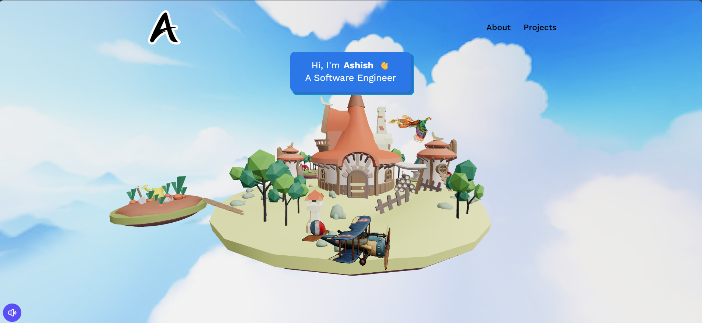

# Hey there! I'm Ashish Dhadekar 👋

🎓 Computer Engineering Student at RGIT, Mumbai (Diploma from Viva College)  
🌐 Passionate Full-Stack Developer building creative and performance-driven websites  
💼 Currently open for freelance or internship opportunities  
🚀 Exploring new tech and building real-world projects

---

# 💻 Tech Stack

### 🚀 Frontend  
 
 
 
 
 
 
 

---

### 🧠 Backend  
 
 
 
 

---

### 🗄️ Database  
 
 
 

---

### 🛠️ Tools & Platforms  
 
 

---

# 📫 Let's Connect

📍 Mumbai, India  
📧 [ashishdhadekar358@gmail.com](mailto:ashishdhadekar358@gmail.com)  
🔗 [LinkedIn](https://linkedin.com/in/ashish-dhadekar)  
💻 [GitHub](https://github.com/ashish358)

---

<picture>
  <source media="(prefers-color-scheme: dark)" srcset="https://raw.githubusercontent.com/ashish358/ashish358/output/github-snake-dark.svg" />
  <source media="(prefers-color-scheme: light)" srcset="https://raw.githubusercontent.com/ashish358/ashish358/output/github-snake.svg" />
  
</picture>
